# koneps — AI 기반 나라장터 공고 분석 플랫폼

**팀명**: 최강제곱  **협력기업**: ㈜넥스트아이앤아이

## 1. 목표와 기능

### 1.1 목표

- 나라장터(G2B) OpenAPI에서 IT 컨설팅 공고(ISP/ISMP 등)를 **자동 수집**하는 플랫폼
- 방대한 제안요청서(RFP)를 사람이 직접 읽지 않아도 **AI가 요구사항·독소조항·평가항목을 구조화**해주는 플랫폼
- 분석 결과를 바탕으로 **제안목차(Word/Excel)를 자동 생성**해 제안 준비 시간을 단축하는 플랫폼
- 담당자(PM) / 대표(CEO) 등 **역할별로 필요한 정보만** 보여주는 대시보드 플랫폼
- 코드 수정 없이 관리자가 **LLM·프롬프트·운영 파라미터를 콘솔에서 직접 조정**할 수 있는 플랫폼
- 단일 LLM 벤더에 종속되지 않는 **Multi-Provider(Gemini/Claude/OpenAI) 추상화**를 갖춘 플랫폼

### 1.2 기능

- 매일 4회(10:00 / 13:00 / 16:00 / 20:00 KST) 자동 수집 + 서버 시작 시 빈틈 보정 수집
- PDF는 Gemini 멀티모달 직접 전송, HWP/HWPX는 리브레AI 변환 후 텍스트 분석
- ISP/ISMP 전용 프롬프트와 범용(SI 구축·유지관리·연구용역) 프롬프트를 분리해 정확도 향상
- 16개 독소조항 체크리스트(S1~L4) + 종합 위험도(safe/caution/warning/danger) 자동 판정
- 요구사항 섹션 원문(verbatim) 보존 추출 — 앵커 식별 LLM + 코드 fuzzy slice
- 제안목차 Excel(4시트: Main / 제안 목차 / RFP 요구사항 / RFP 원문) + 분석 결과 Word 다운로드
- 분석 진행 상황 실시간 폴링 로그 노출, 실패 시 사유 표시 + 재시도
- 관리자 콘솔에서 LLM 설정·프롬프트(버전 히스토리/롤백)·운영 대시보드(동시성·캐시·시드) 관리
- 공고 목록/검색/찜/진행 프로젝트, 담당자별 메모, 새로고침 후에도 마지막 화면 유지(persist)

### 1.3 팀 구성

| 이름 | 역할 |
|---|---|
| 최서원 | 나라장터 OpenAPI 수집기(공고 분류·키워드 필터링·정정공고 정규화), 첨부파일 다운로드, REST API 라우트(bids/search/auth), DB 세션 안정성 개선 |
| 강주현 | DB 스키마 설계, React 대시보드 전반(담당자/CEO 모드 분리, 진행 프로젝트·전략 리포트, 대시보드 캘린더, 로그인/회원가입, 알림 로직) |
| 강현묵 | AI 분석 파이프라인(RFP 프롬프트·독소조항 판정), 제안목차 생성, 관리자 콘솔(LLM 설정·프롬프트 관리·운영 대시보드), Multi-Provider LLM 추상화, 자동 분석 스케줄러 |

---

## 2. 개발 환경 및 배포 URL

### 2.1 개발 환경

| 구분 | 내용 |
|---|---|
| Backend | Python 3.11+, FastAPI, SQLAlchemy 2(async) + asyncpg, APScheduler, SlowAPI |
| 인증 | bcrypt, python-jose (JWT) |
| Database | PostgreSQL 15+ (pgvector) — Supabase 공용 인스턴스 |
| LLM | google-genai · anthropic · openai (Provider 어댑터 패턴) |
| 문서 변환 | 리브레AI(HWP→md), pypdf(PDF→text), BeautifulSoup(HTML 표→md) |
| 출력 | openpyxl(Excel), python-docx(Word) |
| Frontend | React 19 + TypeScript + Vite 8, Tailwind v4, Radix UI, recharts, lucide-react |
| 데이터 수집 | 나라장터 OpenAPI (공고 목록 + e-발주 첨부) |
| 배포 | Docker Compose (postgres + backend + web/nginx) |

### 2.2 배포 URL

- 아직 공인 도메인/서버로 배포되지 않은 캡스톤 개발 단계입니다. 배포 시 서버 IP/도메인과 접속 URL을 이 항목에 기재합니다. (배포 절차는 [`docs/DEPLOYMENT.md`](docs/DEPLOYMENT.md) 참고)

테스트용 계정
```
일반 사용자 : manager01 / 1234
관리자      : admin01   / 1234
```

### 2.3 URL 구조

`/auth`, `/bids`, `/analysis`, `/outline`, `/search`, `/admin` 6개 라우터로 구성된 REST API입니다. (`/bids`, `/analysis`, `/outline`, `/search`는 로그인 필요, `/admin`은 관리자 권한 필요)

**auth**

| App | Method | URL | Note |
|---|---|---|---|
| auth | POST | `/auth/login` | 로그인 (JWT 발급) |
| auth | POST | `/auth/register` | 회원가입 |
| auth | GET | `/auth/me` | 내 정보 조회 |
| auth | PATCH | `/auth/profile` | 프로필 수정 |
| auth | GET | `/auth/agency-settings` | 선호/기피 발주기관 조회 |
| auth | PUT | `/auth/agency-settings` | 선호/기피 발주기관 저장 |

**bids (공고)**

| App | Method | URL | Note |
|---|---|---|---|
| bids | GET | `/bids` | 공고 목록 조회(필터/페이지) |
| bids | GET | `/bids/search` | 공고 검색 (DB → 나라장터 순차 조회) |
| bids | POST | `/bids/collect` | 공고 수집 후 DB 저장 |
| bids | PATCH | `/bids/{bid_ntce_no}/bookmark` 등 | 찜 / 진행 / 상태 토글 |
| bids | GET | `/bids/{bid_ntce_no}/memo` | 공고 메모 조회 |
| bids | PUT | `/bids/{bid_ntce_no}/memo` | 공고 메모 저장 |

**analysis (AI 분석)**

| App | Method | URL | Note |
|---|---|---|---|
| analysis | POST | `/analysis/run/{bid_ntce_no}` | 분석 트리거 (백그라운드 실행) |
| analysis | GET | `/analysis/{bid_ntce_no}/status` | 분석 진행 상황 폴링 |
| analysis | GET | `/analysis/{bid_ntce_no}` | 분석 결과 조회 |
| analysis | GET | `/analysis/{bid_ntce_no}/docx` | 분석 결과 Word 다운로드 |
| analysis | DELETE | `/analysis/{bid_ntce_no}` | 분석 결과 삭제(재분석용) |

**outline (제안목차)**

| App | Method | URL | Note |
|---|---|---|---|
| outline | POST | `/outline/run/{bid_ntce_no}` | 제안목차 생성 트리거 |
| outline | GET | `/outline/{bid_ntce_no}/status` | 생성 진행 상황 폴링 |
| outline | GET | `/outline/{bid_ntce_no}` | 제안목차 결과 조회 |
| outline | GET | `/outline/{bid_ntce_no}/excel` | 제안목차 Excel(4시트) 다운로드 |

**admin (관리자 콘솔, role=admin 전용)**

| App | Method | URL | Note |
|---|---|---|---|
| admin | GET | `/admin/health` | 관리자 콘솔 헬스 체크 |
| admin | GET/PUT | `/admin/prompts`, `/admin/prompts/{key}` | 프롬프트 조회/수정 |
| admin | GET/POST | `/admin/prompts/{key}/history`, `/rollback`, `/reset` | 버전 이력 · 롤백 · 기본값 복원 |
| admin | GET/PUT | `/admin/llm-config` | 활성 LLM 설정 조회/변경 |
| admin | GET/POST/DELETE | `/admin/providers`, `/admin/providers/{provider}/models` | provider·모델 관리 |
| admin | GET/POST | `/admin/ops/status`, `/ops/test-llm`, `/ops/reset-stuck`, `/ops/wipe-*`, `/ops/reseed-prompts` | 운영 상태 조회 + 유지보수 액션 |

---

## 3. 요구사항 명세와 기능 명세

전체 요구사항은 [`docs/REQUIREMENTS.md`](docs/REQUIREMENTS.md)에 정리되어 있습니다. 핵심 기능 요구사항(FR) 요약:

| ID | 요구사항 |
|---|---|
| FR-01 | 공고 자동 수집 (4회/일 + 빈틈 보정 + 2단계 키워드 필터 + 첨부 자동 다운로드) |
| FR-02 | 공고 목록·검색·필터 (상태/마감/찜/진행) |
| FR-03 | AI 분석 — 요구사항·평가항목·독소조항(16개)·위험도(4단계) 구조화 |
| FR-04 | 실시간 진행 로그 폴링 |
| FR-05 | 제안목차 자동 생성 + Excel 내보내기 |
| FR-06 | 담당자 대시보드 (오늘 신규/마감 임박 KPI, 공고 유형 분석, 캘린더) |
| FR-07 | CEO 대시보드 (진행 프로젝트 KPI, 위험 공고 비율, 전략 리포트) |
| FR-08 | 공고별 메모 |
| FR-09 | 찜 / 진행 플래그 |
| FR-10 | 새로고침 후 마지막 화면 유지 (localStorage persist) |

사용자 역할: **담당자(manager)** — 수집·분석·위험도 검토·제안목차 생성 / **대표(CEO)** — 현황 요약·KPI·전략 리포트 조회(제한된 페이지만 접근).

비기능 요구사항, 미구현/예정 항목 등 상세는 [`docs/REQUIREMENTS.md`](docs/REQUIREMENTS.md) 참고.

---

## 4. 프로젝트 구조와 개발 일정

### 4.1 프로젝트 구조

```
koneps_ai_project/
├── backend/
│   ├── main.py                  # FastAPI 진입점 + lifespan (스키마 마이그레이션·시드·스케줄러)
│   ├── config.py                # 설정 (pydantic-settings)
│   ├── api/
│   │   ├── security.py          # bcrypt + JWT + get_current_user + require_admin
│   │   ├── rate_limit.py         # SlowAPI 한도
│   │   └── routes/
│   │       ├── auth.py          # 로그인 / 사용자 정보 / 발주기관 설정
│   │       ├── bids.py          # 공고 목록·상세·수집·검색·북마크
│   │       ├── analysis.py      # 분석 트리거·상태·삭제·Word 다운로드
│   │       ├── outline.py       # 제안목차 트리거·상태·Excel
│   │       ├── search.py        # 공고 검색 (DB → 나라장터)
│   │       └── admin.py         # /admin/* (prompts, llm-config, providers, ops)
│   ├── collector/
│   │   ├── naramarket.py        # 나라장터 OpenAPI 호출 + 공고 분류
│   │   ├── service.py           # save_bids + collect_and_save
│   │   ├── file_downloader.py   # 첨부 다운로드
│   │   └── g2b_service.py       # e-발주 첨부 보강
│   ├── services/
│   │   ├── extract.py               # PDF/HWP → converted_md 캐싱 + HTML 표 정리
│   │   ├── analysis_service.py      # 분석 파이프라인
│   │   ├── analysis_queue.py        # 동시성·backoff·일일 한도 큐
│   │   ├── analysis_docx.py         # AI 분석 결과 Word 빌더
│   │   ├── outline_service.py       # 제안목차 LLM + Excel 빌더
│   │   ├── rfp_extract.py           # 앵커 식별 LLM + fuzzy slice
│   │   ├── hwp_service.py           # 리브레AI HWP→md 클라이언트
│   │   ├── progress_store.py        # 인메모리 작업 로그(폴링용)
│   │   ├── prompt_store.py          # 프롬프트 DB 저장소 + 버전 관리
│   │   ├── llm_config_store.py      # 활성 LLM 설정 + provider 모델 레지스트리
│   │   └── llm/
│   │       ├── base.py              # LLMProvider ABC + LLMRequest/Response
│   │       ├── exceptions.py        # 공통 예외 계층
│   │       ├── gemini.py / claude.py / openai.py  # provider 어댑터
│   │       └── registry.py          # call_with_fallback 헬퍼
│   ├── prompts/                 # rfp_analysis / outline_generation / rfp_section
│   ├── db/
│   │   ├── models.py            # SQLAlchemy ORM 정의
│   │   ├── crud.py              # CRUD 헬퍼
│   │   └── database.py          # async engine + SessionLocal
│   └── scripts/
│       ├── seed_admin.py        # CLI: 관리자 계정 추가/갱신
│       └── ask_gemini.py        # Gemini 단발 호출 디버깅
├── frontend/src/
│   ├── App.tsx                  # 라우팅 (role='admin' → AdminConsole, 그 외 → 사이드바+페이지)
│   ├── services/api.ts          # 백엔드 호출 + JWT 래퍼 + 도메인 매핑
│   ├── types.ts                 # Bid / AnalysisLog / RiskFactor 등
│   └── components/
│       ├── LoginPage.tsx / Sidebar.tsx
│       ├── BidTable.tsx + BidSlideOver.tsx + BidDetailPanel.tsx
│       ├── AnalysisDetailPage.tsx      # 분석/독소/제안목차 탭
│       ├── ProposalOutlinePage.tsx + ProposalPage.tsx
│       ├── DashboardHeader.tsx + KpiCards.tsx + BottomWidgets.tsx
│       ├── BookmarkPage.tsx + ProjectPage.tsx + StrategyReportPage.tsx
│       ├── SettingsPage.tsx
│       └── AdminConsole.tsx + AdminLLMConfig.tsx + AdminPromptManager.tsx + AdminOps.tsx
├── db/schema.sql                # 초기 스키마 (참고용 — lifespan이 idempotent하게 보장)
├── samples/                     # ISP/ISMP 학습 샘플 (Excel + analysis.md)
├── docs/                        # ARCHITECTURE / REQUIREMENTS / WORKFLOW / DEPLOYMENT
└── docker-compose.yml
```

### 4.2 개발 일정(WBS)

**6월 22일 대회 일정**에 맞춰 그 전날인 **6월 21일까지 개발을 완료**하는 것을 목표로, 크게 **① 초기 세팅 → ② 핵심 기능 구현 → ③ 고도화·안정화 → ④ 최종 완료** 4단계로 진행했습니다.

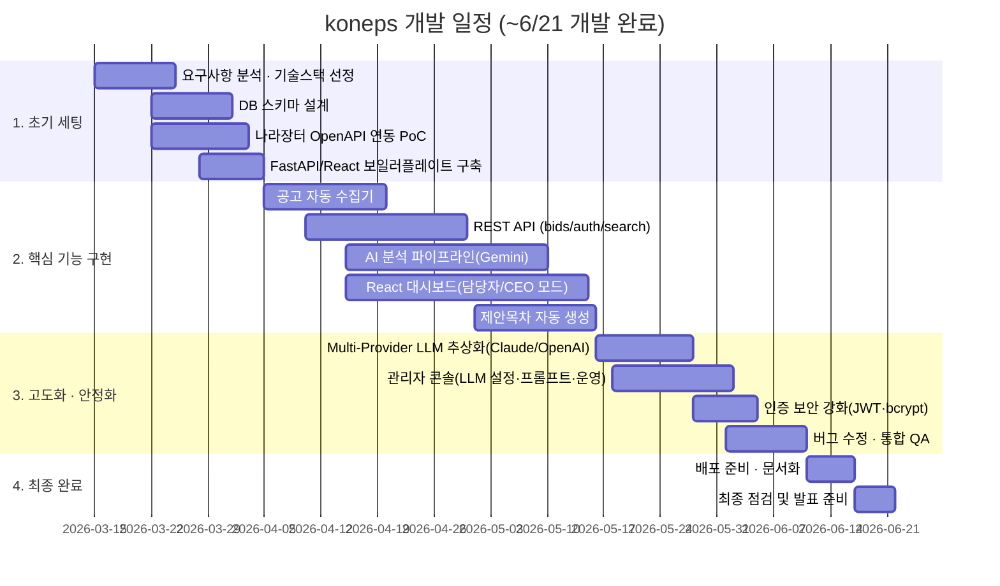

| 기간 | 단계 | 주요 내용 |
|---|---|---|
| 3월 중순 ~ 4월 초 | ① 초기 세팅 | 요구사항 정의, 기술스택 확정, DB 스키마 설계, 나라장터 OpenAPI 연동 검증, 개발 환경 구축 |
| 4월 초 ~ 5월 중순 | ② 핵심 기능 구현 | 공고 자동 수집, REST API, AI 분석(RFP→JSON) 파이프라인, React 대시보드, 제안목차 생성까지 주요 기능 대부분 완성 |
| 5월 중순 ~ 6월 초 | ③ 고도화 · 안정화 | Multi-Provider LLM 확장, 관리자 콘솔, 인증 보안 강화, 버그 수정 및 전체 QA |
| 6월 초 ~ **6월 18일** | ④ 최종 완료 | 배포 준비·문서 정리·최종 점검까지 마쳐 **대회(6/19) 전 개발 완료** |

- 브랜치·PR 흐름을 통한 실제 진행 이력은 GitHub PR/커밋 로그([`docs/WORKFLOW.md`](docs/WORKFLOW.md))로 추적 가능합니다.

+ 7월 초 간단한 버그 수정

---

## 5. 역할 분담

| 담당 | 이름 |
|---|---|
| 나라장터 OpenAPI 수집기(공고 분류·키워드 필터링·정정공고 정규화), 첨부파일 다운로드, REST API 라우트(bids/search/auth), DB 세션 안정성 개선 | 최서원 |
| DB 스키마 설계, React 대시보드 전반(담당자/CEO 모드 분리, 진행 프로젝트·전략 리포트, 대시보드 캘린더, 로그인/회원가입, 알림 로직) | 강주현 |
| AI 분석 파이프라인(RFP 프롬프트·독소조항 판정), 제안목차 생성, 관리자 콘솔(LLM 설정·프롬프트 관리·운영 대시보드), Multi-Provider LLM 추상화, 자동 분석 스케줄러 | 강현묵 |

---

## 6. UI / BM

### 화면 구성

> 아래 이미지는 `docs/images/screens/` 경로 기준 placeholder입니다. 실제 스크린샷/GIF를 해당 경로에 추가하면 표에 그대로 보입니다.

| 로그인 | 회원가입 |
|---|---|
| 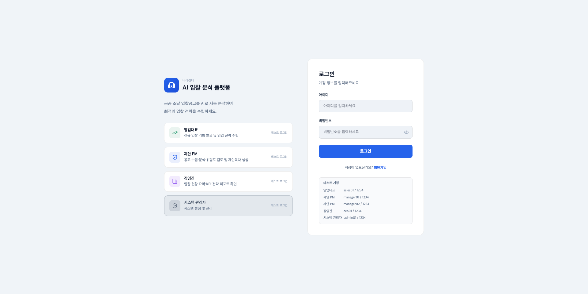 | 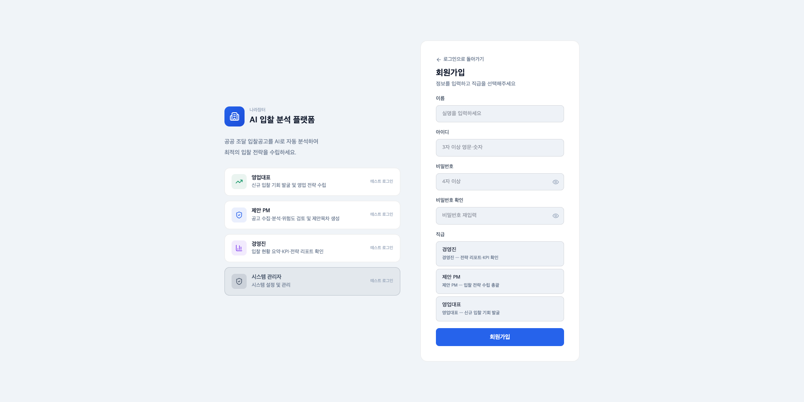 |

| 대시보드 (담당자 모드) | 대시보드 (CEO 모드) |
|---|---|
| 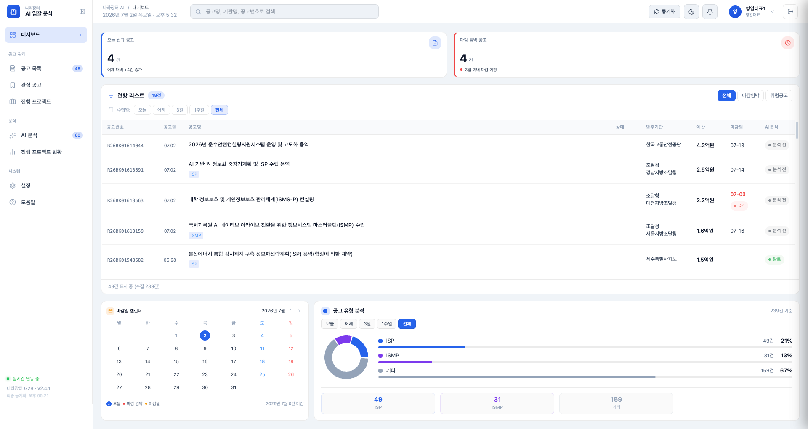 | 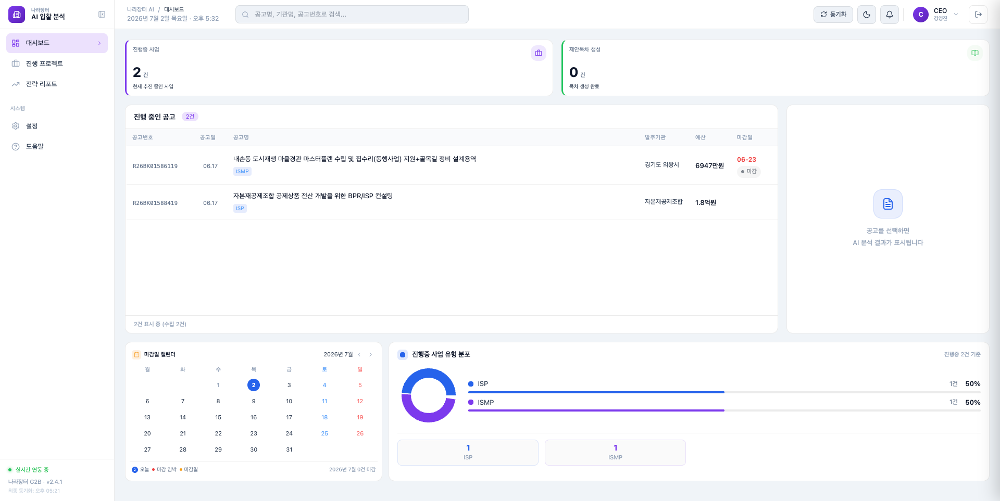 |

| 공고 목록 · 검색 | 공고 상세 (슬라이드오버) |
|---|---|
| 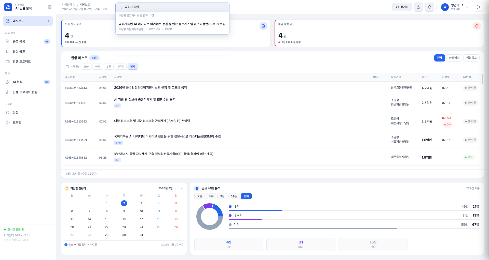 | 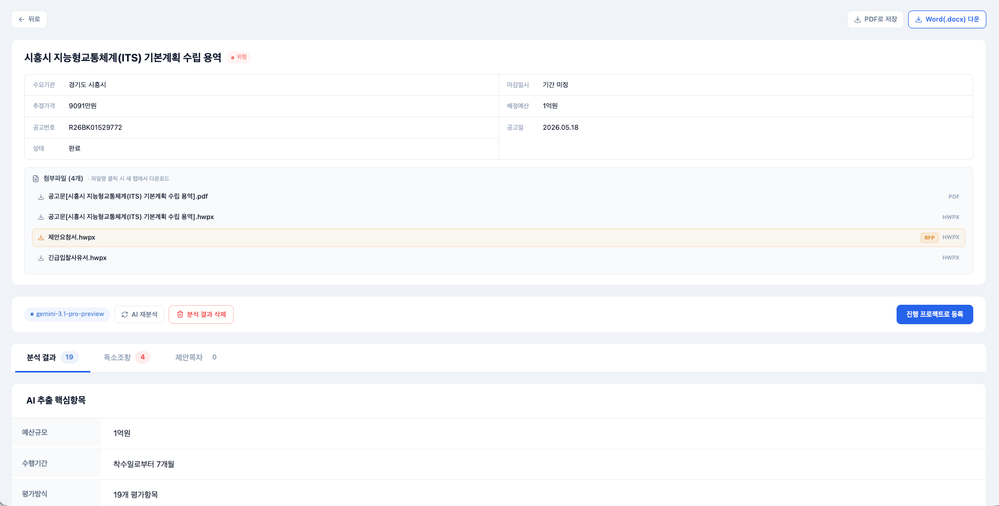 |

| AI 분석 결과 (독소조항) | 제안목차 생성 |
|---|---|
| 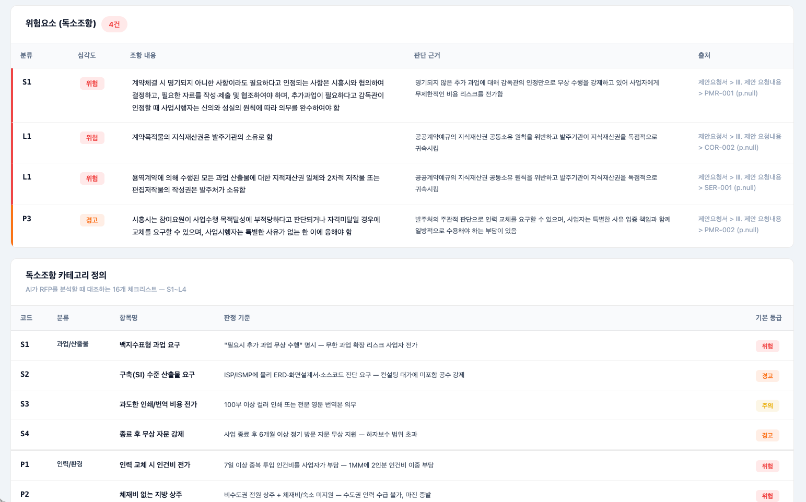 |  |

| 찜한 공고 / 진행 프로젝트 | 전략 리포트 |
|---|---|
| 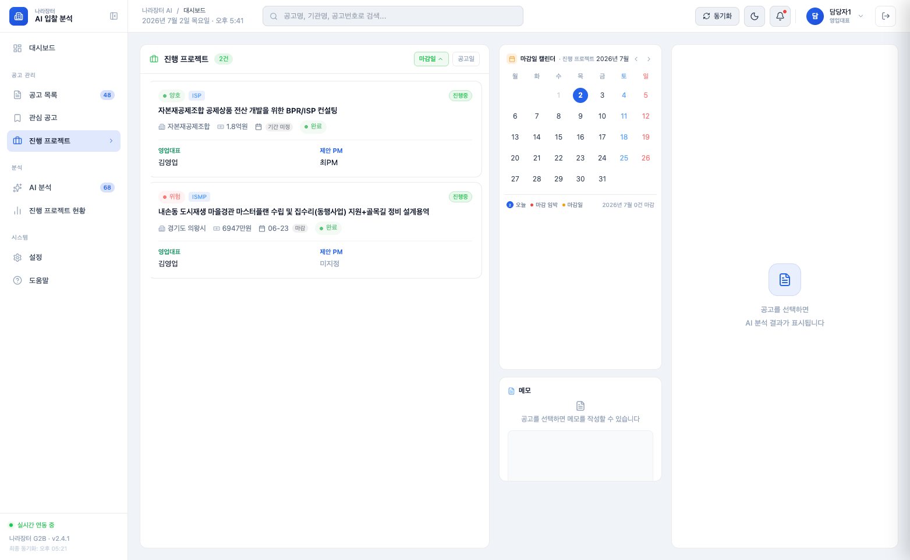 | 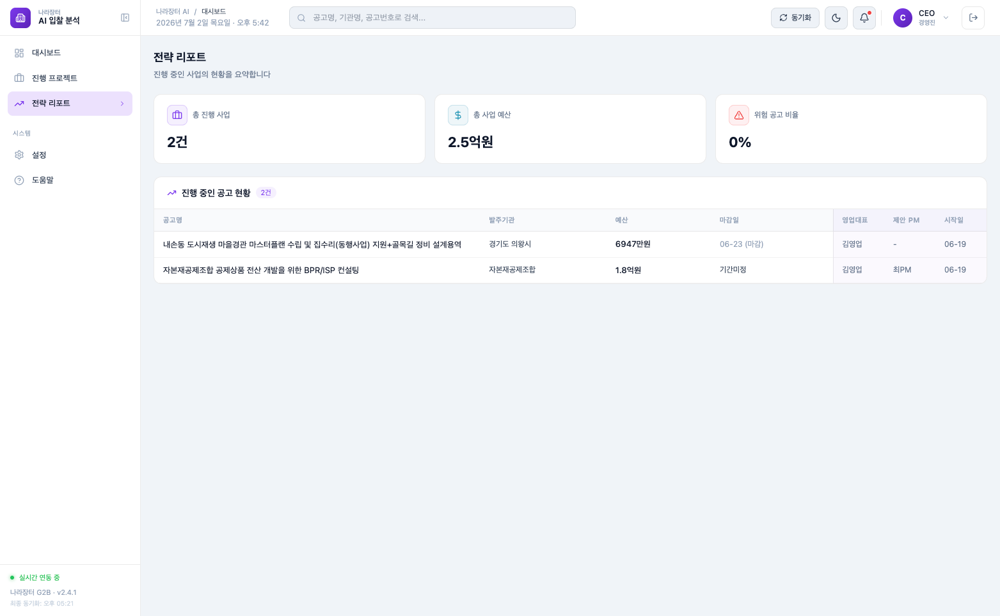 |

| 관리자 콘솔 (LLM 설정) | 관리자 콘솔 (프롬프트 관리) |
|---|---|
| 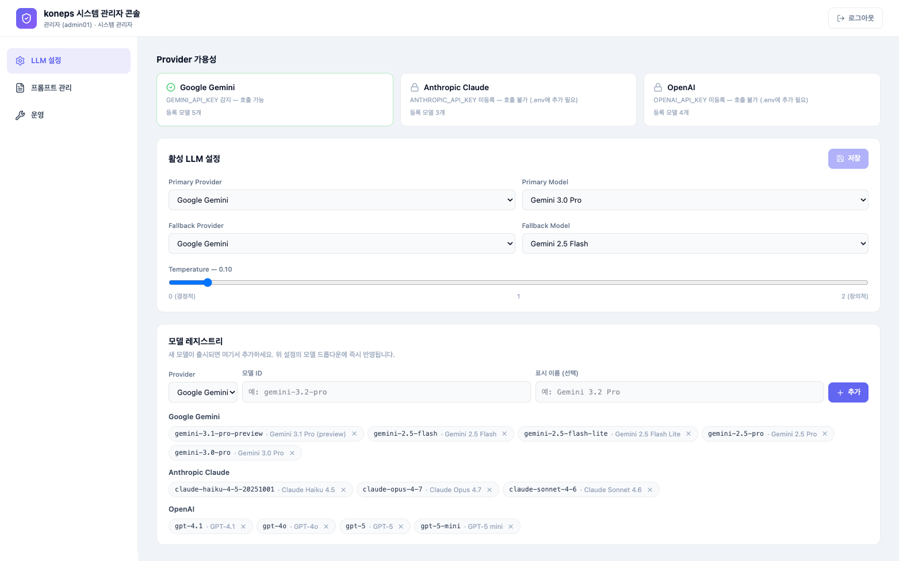 | 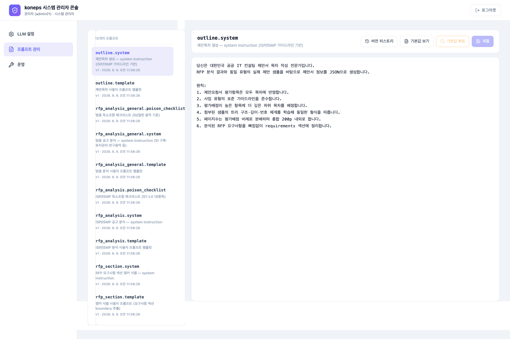 |

### BM (비즈니스 모델)

- **핵심 가치**: 나라장터 공고 수집 → AI 기반 RFP 분석 → 제안목차 생성까지 자동화해, 제안 담당자가 방대한 RFP를 처음부터 직접 정독하지 않고도 핵심 요구사항·평가항목·독소조항을 바로 파악해 입찰 여부를 빠르게 판단하고 제안 작업에 착수할 수 있게 합니다.
- **기대 효과**:
  - RFP 검토 시간 단축 → 동일 인력으로 더 많은 공고에 대응(입찰 기회 확대)
  - 16개 독소조항 자동 검출로 계약 리스크 사전 차단
  - 제안목차 초안 자동 생성으로 제안서 착수 속도 향상
- **적용 형태**: 현재는 협력기업 ㈜넥스트아이앤아이의 제안 업무를 지원하는 전용 도구로 운영되며, Multi-Provider LLM 추상화·프롬프트 관리 콘솔을 갖추고 있어 향후 다른 컨설팅/SI 기업 대상으로 확장하기에도 용이한 구조입니다.

---

## 7. 데이터베이스 모델링(ERD)

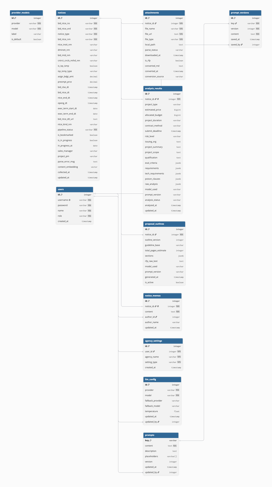

```
notices ──┬─< attachments          (converted_md 캐시)
          ├─< analysis_results     (raw_analysis / poison_clauses JSONB)
          ├─< proposal_outlines    (sections + rfp_raw_text)
          └─< notice_memos

users ────┬─< agency_settings      (선호/기피 발주기관)
          ├─< prompts.updated_by
          └─< llm_config.updated_by

prompts ──< prompt_versions        (롤백 히스토리)
llm_config (싱글톤 id=1)
provider_models                    (UNIQUE provider+model)
```

| 테이블 | 역할 | 핵심 컬럼 |
|---|---|---|
| `notices` | 수집된 공고 | bid_ntce_no, bid_ntce_nm, ntce_instt_nm, bid_clse_dt, pipeline_status |
| `attachments` | 공고 첨부파일 | notice_id, file_name, file_type, file_url, local_path, converted_md |
| `analysis_results` | AI 분석 결과 (1:1) | project_type, estimated_price, risk_level, eval_criteria(JSONB), requirements(JSONB), poison_clauses(JSONB), raw_analysis(JSONB) |
| `proposal_outlines` | 제안목차 (1:N) | notice_id, sections(JSONB), guideline_base, rfp_raw_text |
| `users` | 로그인 계정 | username, password(bcrypt), name, role |
| `notice_memos` | 공고별 담당자 메모 | notice_id, content, author_name |
| `prompts` / `prompt_versions` | 프롬프트 + 버전 이력 | key, content, default_content, version |
| `llm_config` / `provider_models` | 활성 LLM 설정 + 등록 모델 | provider, model, temperature, fallback_model |

설계 원칙: **자주 필터/집계하는 필드는 정형 컬럼, 가변/리스트형(독소조항·요구사항·제안목차 섹션 등)은 JSONB**로 저장. 정식 스키마는 [`db/schema.sql`](db/schema.sql), 상세 설명은 [`docs/ARCHITECTURE.md`](docs/ARCHITECTURE.md) 참고.

---

## 8. Architecture

```
[조달청 나라장터 OpenAPI]
        │
        ▼
[Collector] ─── 4회/일 자동 + 빈틈 보정 + 수동
        │  (notices + attachments)
        ▼
[PostgreSQL(+pgvector) — Supabase]
        │
        ▼
[FastAPI Backend] ─── REST + 진행상황(폴링) + 관리자 콘솔 API
        │
        ▼
[React Frontend] ─── 담당자 / CEO 모드 + 관리자 콘솔
        │
        ▼
[Multi-Provider LLM] ─ Gemini / Claude / OpenAI (fallback 체인)
[리브레AI] ─ HWP/HWPX → MD 변환
```

- **AI 분석 파이프라인**: `POST /analysis/run/{bid_ntce_no}` → 백그라운드 태스크 → 첨부 로드(local_path 우선, G2B fallback) → PDF는 원본 바이트 직접 전송 / HWP는 리브레AI 변환 텍스트 전송 → LLM 호출(429/503 재시도 + fallback 모델) → JSON 파싱(poison_clauses/eval_criteria/requirements/basic_info) → `analysis_results` upsert. 진행 상황은 `GET /analysis/{bid_ntce_no}/status` 폴링으로 노출.
- **Multi-Provider 추상화**: `LLMProvider` 인터페이스 + `call_with_fallback(config, request, timeout)`. PDF 처리 방식 차이(Gemini native / Claude 32MB 이내 native+text 폴백 / OpenAI 항상 text)와 RateLimit·Timeout·ContextOverflow·ProviderError를 공통 예외로 정규화.

상세 다이어그램·계층 설명은 [`docs/ARCHITECTURE.md`](docs/ARCHITECTURE.md) 참고.

---

## 9. 메인 기능

### 자동 수집 + 자동 분석
나라장터 OpenAPI를 매일 4차례(10:00 / 13:00 / 16:00 / 20:00 KST) 자동 호출해 신규 IT 컨설팅 공고를 수집하고, 서버 시작 5초 후 마지막 수집 슬롯 이후의 누락분을 자동으로 보완합니다. 수집 직후 `analysis_queue`가 신규 공고를 즉시 큐에 넣어 동시성 제한(`ANALYSIS_CONCURRENCY`)과 일일 한도(`AUTO_ANALYSIS_DAILY_CAP`) 안에서 백그라운드로 분석을 시작하며, RFP 첨부가 없는 공고는 사유를 기록하고 자동 제외합니다.

### AI 분석 — RFP를 구조화된 JSON으로
PDF는 Gemini 멀티모달에 바이트를 직접 전송하고, HWP/HWPX는 리브레AI로 변환한 텍스트를 전송합니다. ISP/ISMP 전용 프롬프트와 SI 구축·유지관리·연구용역 등을 위한 범용 프롬프트를 분리해 정확도를 높였고, 발주기관·마감·금액·요구사항(코드별 ID/name/description)·평가항목·자격요건과 함께 16개 독소조항 체크리스트 및 종합 위험도(safe/caution/warning/danger)를 추출합니다.

### 제안목차 + RFP 원문 추출
ISP/ISMP 가이드라인과 동일 유형의 학습 샘플을 자동으로 첨부해 제안목차 생성 LLM을 호출하고, 요구사항 섹션은 앵커 식별 LLM과 코드 fuzzy slice를 조합해 원문 그대로 보존 추출합니다. 결과는 Excel(Main/제안 목차/RFP 요구사항/RFP 원문 4시트)로, AI 분석 결과는 별도 Word 문서로 다운로드할 수 있습니다.

### 관리자 콘솔
`role='admin'` 계정으로 로그인하면 일반 사이드바 대신 전용 관리자 셸로 진입합니다. LLM 설정(provider/모델/temperature/fallback 즉시 변경 및 신규 모델 동적 등록), 프롬프트 관리(10개 프롬프트 키 편집, 필수 placeholder 검증, 버전 히스토리·롤백·기본값 복원), 운영 대시보드(동시성·캐시·시드 현황 조회 + stuck 초기화·캐시 wipe·프롬프트 재시드·LLM 테스트 호출)를 코드 수정 없이 콘솔에서 직접 수행할 수 있습니다.

### 사용자 워크플로
담당자(manager)와 대표(CEO) 역할별로 서로 다른 사이드바를 제공하며, 공고 목록·검색·찜·진행 프로젝트 관리, 공고 상세에서 첨부 다운로드·분석 결과·독소조항·제안목차 탭 확인이 가능합니다. 분석 진행 중에는 폴링으로 실시간 로그가 노출되고, 실패 시 사유와 함께 "다시 시도" 버튼이 표시됩니다.

---

## 10. 에러와 에러 해결

개발 과정에서 겪은 주요 이슈와 해결 방식은 이 항목에 계속 채워나갈 예정입니다. 현재까지 파악된 알려진 한계는 다음과 같습니다.

| 항목 | 내용 | 비고 |
|---|---|---|
| 리브레AI 일 50회 한도 | HWP/HWPX 변환 호출이 일일 50회로 제한됨 | `attachments.converted_md` 캐시로 재호출 최소화, 초과 시 다음날 자동 리셋되며 분석은 PDF 경로로 폴백 |
| 분석 진행 상황 — 폴링 방식 | SSE 대신 폴링으로 구현되어 있음 | 현재 트래픽 규모에서는 충분히 동작, 추후 SSE 전환 검토 |
| 검색 → 상세 진입 동선 | 검색 결과 드롭다운에서 클릭 시 상세 화면으로 바로 연결되지 않음 | 현황 리스트 행 클릭을 통한 진입은 정상 동작 |
| 자동 동기화 버튼 | `handleSync`가 collect API에 의존해 실패 시 목록 갱신(`fetchBids`)도 함께 실패 | 에러 핸들링 보강 예정 |
| Gemini 401/403 | `.env`의 `GEMINI_API_KEY` 오타 또는 만료 | Google AI Studio에서 키 재발급 후 재기동 |

---

## 부가 문서

- [`docs/ARCHITECTURE.md`](docs/ARCHITECTURE.md) — 시스템 아키텍처 다이어그램·계층
- [`docs/REQUIREMENTS.md`](docs/REQUIREMENTS.md) — 요구사항 정의
- [`docs/WORKFLOW.md`](docs/WORKFLOW.md) — 개발 워크플로 + 브랜치/커밋 규칙 + 디버깅 가이드
- [`docs/DEPLOYMENT.md`](docs/DEPLOYMENT.md) — Docker Compose 배포 가이드

## 빠른 시작

### 사전 준비
- Python 3.11+, Node 20+, Docker (또는 공용 Supabase 접근)
- API 키: `NARA_API_KEY`, `GEMINI_API_KEY`, `LIBREAI_API_KEY`

### 1) 의존성
```bash
# 백엔드
python -m venv venv && source venv/bin/activate
pip install -r backend/requirements.txt

# 프론트
cd frontend && npm install
```

### 2) .env 설정
`.env.example` 복사 후 값 채움. 최소 필수: `DATABASE_URL`, `NARA_API_KEY`, `GEMINI_API_KEY`, `LIBREAI_API_KEY`, `LIBREAI_API_URL`, `JWT_SECRET_KEY`

### 3) 실행
```bash
# 백엔드 (프로젝트 루트)
uvicorn backend.main:app --port 8001 --log-level info

# 프론트 (별도 터미널)
cd frontend && VITE_API_BASE_URL=http://localhost:8001 npm run dev
```

부팅 시 lifespan이 모든 테이블·컬럼·시드를 idempotent하게 처리하므로 별도 마이그레이션 명령은 필요 없습니다.

## 보안 메모

- `.env`는 `.gitignore` 처리됨 (`.env.bak` 포함)
- JWT 시크릿은 최소 16자 임의 문자열 필수 (`security.py` import 시 검증)
- 비밀번호는 bcrypt 해시로 저장 (평문 X)
- `/admin/*` 라우터는 `require_admin` 가드로 비-admin 403 처리
- 어드민 콘솔의 LLM 설정·프롬프트 변경은 `prompt_versions` / `llm_config.updated_by`로 감사 추적

## 브랜치 & 커밋 규칙

```
main      ← 릴리즈 (Approve 2명)
 └ develop ← 통합 (Approve 1명, 기본 PR target)
     ├ feature/<이슈번호>-<설명>
     ├ fix/<설명>
     └ refactor/<설명>
```

커밋 prefix: `Feat:`(새 기능) / `Fix:`(버그) / `Refactor:` / `Docs:` / `Chore:` / `Test:`
